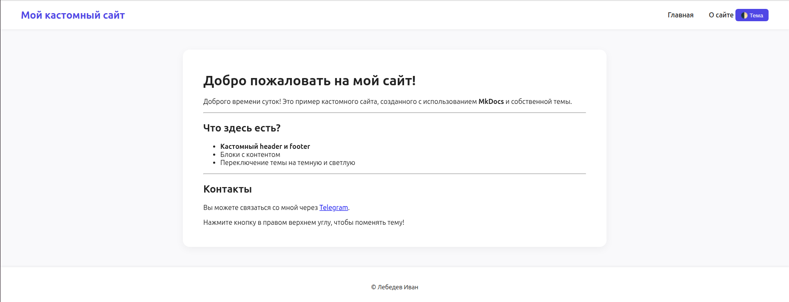
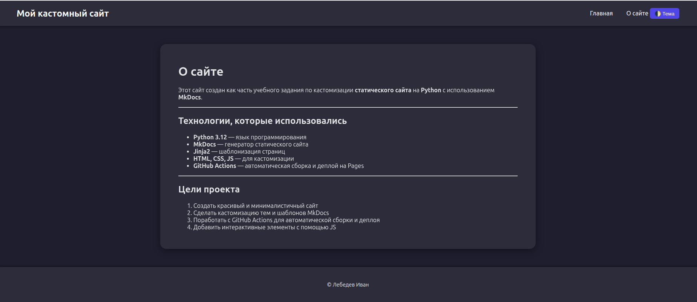
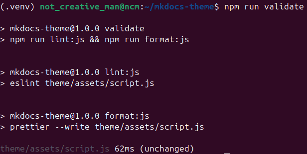
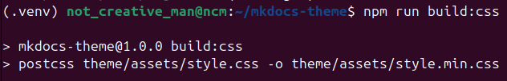
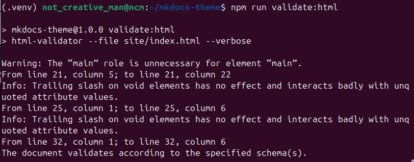
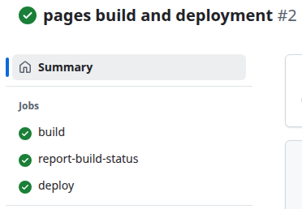

# Отчет по выполнению задания: Создание кастомной темы для MkDocs и автоматический деплой на GitHub Pages

Выполнил: Лебедев Иван

## 1. Цель работы

Создать собственную тему для сайта с использованием HTML, CSS и JS, а также настроить автоматическую сборку и деплой сайта с контентом Markdown на GitHub Pages через GitHub Actions.

---

## 2. Задачи

Создать кастомную тему для MkDocs с:

- кастомным header и footer;
- стилизованной главной страницей;
- метаданными сайта (название, описание, автор).

Настроить пайплайн для:

- тестирования и проверки JS через ESLint и Prettier;
- минификации и обработки CSS через PostCSS;
- проверки валидности HTML;
- сборки сайта MkDocs и деплоя на GitHub Pages.

Обеспечить доступность сайта через GitHub Pages с корректным отображением всех страниц и стилей.

---

## 3. Реализация

### 3.1. Создание темы

Были созданы следующие файлы в папке `theme/`:
- **Шаблон страницы:** [main.html](https://github.com/not-creative-man/mkdocs-theme/blob/main/theme/main.html)
- **Стили и скрипты:** [style.css](https://github.com/not-creative-man/mkdocs-theme/blob/main/theme/assets/style.css), [style.min.css](https://github.com/not-creative-man/mkdocs-theme/blob/main/theme/assets/style.min.css), [script.js](https://github.com/not-creative-man/mkdocs-theme/blob/main/theme/assets/script.js)
- Настроен кастомный header и footer с поддержкой светлой и темной темы.
Внутри проекта создана папка docs/, которая содержит в себе контент для сайта, а именно два файла - [index.md](https://github.com/not-creative-man/mkdocs-theme/blob/main/docs/index.md) и [about.html](https://github.com/not-creative-man/mkdocs-theme/blob/main/docs/about.md). Эти два файла представляют собой отдельные страницы сайта, содержащие контент в формате Markdown, который интегрируется в шаблоны темы MkDocs для отображения как подстраницы.

Страница 1 со светлой темой:

Страница 2 c темной темой:

## 4. Настройка проверки и тестирования

Созданы конфигурационные файлы: [postcss.config.js](https://github.com/not-creative-man/mkdocs-theme/blob/main/postcss.config.js) для обработки и минификации CSS.
Также добавлены файлы: [.eslint.config.cjs](https://github.com/not-creative-man/mkdocs-theme/blob/main/eslint.config.cjs) и [.eslintrc.json](https://github.com/not-creative-man/mkdocs-theme/blob/main/.eslintrc.json) для проверки JavaScript.

Проверка JS и форматирования:

Минификация CSS:

Валидация HTML:

## 5. Настройка автоматического деплоя

Создан файл [.github/workflows/deploy.yml](https://github.com/not-creative-man/mkdocs-theme/blob/main/.github/workflows/deploy.yml) для деплоя через GitHub Actions.

C помощью токена был настроен доступ к репозиторию для автоматического деплоя на ветку gh-pages.

## 6. Результат

Сайт доступен на GitHub Pages по адресу: [https://not-creative-man.github.io/mkdocs-theme/](https://not-creative-man.github.io/mkdocs-theme/).

Все страницы корректно отображаются с кастомной темой, стилями и скриптами. Изменения в ветке main автоматически собираются и деплоятся на сайт. 

Действия, которые выполняются при каждом коммите: установка Python и зависимости MkDocs, установка Node.hs и npm-зависимости, валидация и форматирование JS, минификация CSS через PostCss, сборка сайта.
